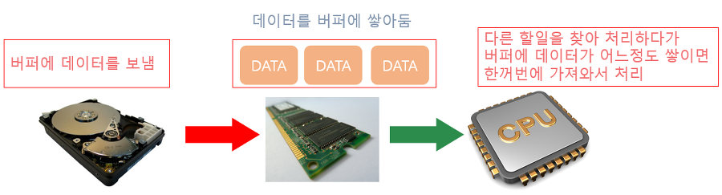

# BufferReader란 무엇일까?


## 버퍼의 특징

- 사용자에게 받은 데이터를 파싱하지 않고 그대로 String으로 가져온다
- 그래서 String 데이터를 Long 이나 String과 같은 Wrapper 클래스를 활용해서 파싱해주어야 한다
- 기본적으로 8KB의 버퍼를 사용한다
- TreadSafe 하여 멀티 스레드 환경에 안전하다: 이건 좀 논란이 되는 부분인듯 하다.

## Buffer?



버퍼란, CPU와 RAM 사이에 주로 위치하여 둘 사이의 처리량 차이를 메꾸기 위해 존재한다.
사용자의 입력이 I/O를 통해 들어오면, 많은 데이터가 RAM에 들어가게되고, 이러한 데이터를 CPU에서 처리하기 힘드니 버퍼에 놓고 쓰는 것.

버퍼의 역할을 정리하자면 다음과 같다.

1. 데이터 임시 저장 및 속도 차이 완화
위에서 언급한 케이스. CPU와 저장장치 간의 처리량 차이를 완화한다.
2. 데이터 흐름 조절
네트워크 스트리밍등을 조절할때 버퍼가 그 사이에서 데이터의 흐름을 조절 할 수 있다
3. 비동기 작업 지원
이건 솔직히 무슨 말인지 잘 모르겠습니다.

이를 테스트하기 위한 좋은 예시가 **FileReader와 BufferReader**의 차이인데,
FIleReader는 데이터를 읽을때 글자별로 Disk I/O가 발생함.
하지만 Buffer는 8KB의 데이터를 한 번에 읽어오기 때문에 확연한 Disk I/O의 면에서 이득이 있다는거지.

-> 이로 인해서 대규모의 데이터를 다루는 작업에 있어서 BufferReader는 큰 이점을 가질 수 있습니다.
지금 진행하는 OCR 관련 프로젝트에서 대규모 문서를 다루는데,
이는 MySQL 기반에서 TEXT란 대규모 데이터 타입을 이용해서 저장한 데이터를 다룹니다.

과연 이를 버퍼리더로 최적화 할 수 있을 것인가...


## TreadSafe?

멀티 스레드 환경에서 안전한 타입이라는 소리인데, 사실은 그렇지는 않은 듯함.
BufferReader는 버퍼에서 8KB 마다 데이터를 파싱하는데, 이 과정에서 포인터가 안전하지 않다.


```

    public int read() throws IOException {
        synchronized (lock) {
            ensureOpen();
            for (;;) {
                if (nextChar >= nChars) {
                    fill();
                    if (nextChar >= nChars)
                        return -1;
                }
                if (skipLF) {
                    skipLF = false;
                    if (cb[nextChar] == '\n') {
                        nextChar++;
                        continue;
                    }
                }
                return cb[nextChar++];
            }
        }
    }

```

하지만 BufferReader 내부에 sysnchronized를 이용하여 동시성을 제어하는 모습을 볼 수 있어서,
멀티 스레드 환경에서 안전하다고 볼 수 있지 않을까?

이는 나중에 좀 더 알아보도록 하자...FIXME


# Scanner


## Scanner 의 특징

- java.util 패키지에 속한다. (java.util.Scanner)
- 공백(띄어쓰기) 및 개행(줄 바꿈)을 기준으로 읽는다.(' ', '\t', '\r', '\n' 등)
- 원하는 타입으로 읽을 수 있다.
- 버퍼의 사이즈가 1024byte(1KB) 이다.
- UnChecked(Runtime) Exception으로 별도로 예외 처리를 명시할 필요가 없다.
- Thread unsafe 성질을 지니기에 멀티스레드 환경에서 문제가 발생할 수 있다.
- 데이터를 입력받을 경우 즉시 사용자에게 전송되며 입력받을 때마다 전송되어야 하기에 많은 시간이 소요된다.


Scanner는 기본적으로 1KB의 버퍼를 점유한다.
그래서 1KB 아래의 입력값이라면 보다 효율적인 메모리 관리가 가능할 것이야.
그리고 기본적으로 Scanner는 parser이다. 그래서 따로 문자열 파싱 로직을 만들 필요가 없다는 것.


